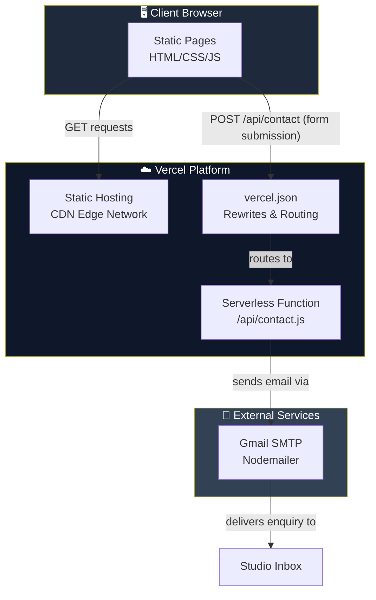
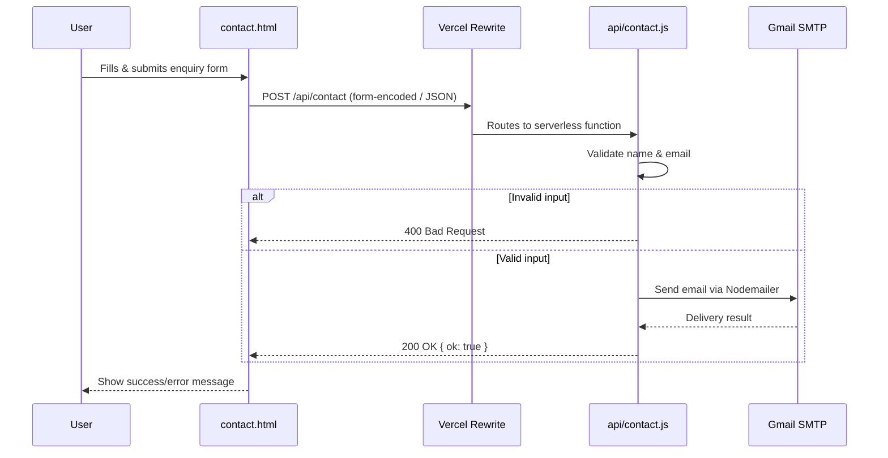

<div align="center">

# 🎨 DA Design Visuals

### Interior Design & Visualization Studio — Marketing Website

A fast, static, multi-page website with a serverless contact API, deployed on Vercel.

[](#)
[](#)
[](#)
[](#)
[](#)
[](#)

</div>

---

## 📖 Table of Contents

- [About The Project](#-about-the-project)
- [Architecture](#-architecture)
- [Tech Stack](#-tech-stack)
- [Project Structure](#-project-structure)
- [Getting Started](#-getting-started)
- [Environment Variables](#-environment-variables)
- [Contact API](#-contact-api)
- [Deployment](#-deployment)
- [Pages Overview](#-pages-overview)
- [SEO & Metadata](#-seo--metadata)
- [Contributing](#-contributing)
- [Maintainers](#-maintainers)

---

## 🧭 About The Project

**DA Design Visuals** is a marketing website for an interior design & visualization studio. It showcases the studio's portfolio, services, blog content, and provides a working contact form that emails enquiries directly to the studio, powered by a Vercel serverless function.

The site is built as **static HTML/CSS/JS** — no frontend framework, no build step — optimized for simplicity, speed, and easy handover to non-technical maintainers.

---

## 🏗 Architecture

The project follows a **clean separation between static presentation and serverless logic**:



### Architectural Principles

| Layer | Responsibility | Technology |
|---|---|---|
| **Presentation** | Multi-page static HTML, styling, animation, UX interactions | HTML5, CSS3 (Bootstrap, SCSS), vanilla JS, GSAP |
| **Client Interactivity** | Sliders, popups, filters, cursor effects, form handling | Swiper, Slick, Magnific Popup, Isotope, WOW.js |
| **API / Backend** | Stateless serverless function, no database, no persistent server | Node.js (Vercel Serverless Functions) |
| **Delivery** | Transactional email dispatch for contact form enquiries | Nodemailer + Gmail SMTP |
| **Hosting/Infra** | Static asset CDN + function routing/rewrites | Vercel |

### Request Flow (Contact Form)



### Why a dual-folder layout?

This repository currently ships the canonical site inside [DA Design Visuals/](DA%20Design%20Visuals) (containing `assets/`), while mirrored HTML entry points also exist at the repository root for deployment convenience. See [Project Structure](#-project-structure) for details.

---

## 🛠 Tech Stack

<table>
<tr>
<td valign="top" width="50%">

**Frontend**
- HTML5 / CSS3 / Vanilla JavaScript
- Bootstrap (grid & layout)
- SCSS (source styles under `assets/scss`)
- Swiper & Slick (carousels/sliders)
- Magnific Popup (lightbox/gallery)
- Isotope + imagesLoaded (portfolio filtering)
- GSAP (ScrollTrigger, ScrollSmoother, SplitText)
- WOW.js + Animate.css (scroll animations)
- Three.js / WebGL (visual effects)
- Nice Select, Range Slider, PureCounter

</td>
<td valign="top" width="50%">

**Backend / Infra**
- Node.js ≥ 18
- Vercel Serverless Functions
- Nodemailer (Gmail SMTP transport)
- Vercel rewrites (`vercel.json`) for API routing
- `http-server` for local static preview

</td>
</tr>
</table>

---

## 📁 Project Structure

```text
DA-Design-Visuals/
├── api/
│   └── contact.js              # Serverless function: POST /api/contact
├── DA Design Visuals/          # ⭐ Canonical site source (assets live here)
│   ├── index.html
│   ├── about-us.html
│   ├── our-work.html
│   ├── project.html / project-detail.html
│   ├── blogs.html / blog-1.html / blog-detail.html
│   ├── contact.html
│   ├── api/contact.js          # Local copy used when serving this subfolder
│   └── assets/
│       ├── css/                # Compiled stylesheets (bootstrap, swiper, etc.)
│       ├── scss/                # SCSS source partials
│       ├── js/                  # Vendor + custom scripts (app.js, main.js, gsap*, etc.)
│       ├── img/                 # UI images, icons, SVGs, per-page media
│       ├── fonts/               # Icon/font files
│       ├── Project Gallery Imges/  # Portfolio project photography (by project)
│       ├── Instagram/           # Social feed assets
│       ├── Team/                # Team member photos
│       └── site.webmanifest
├── index.html                  # Root mirror entry points (deployment convenience)
├── about-us.html
├── our-work.html
├── project.html / project-detail.html
├── blogs.html / blog-1.html / blog-detail.html
├── contact.html
├── robots.txt                  # Crawler rules
├── sitemap.xml                 # Search engine sitemap
├── vercel.json                 # Rewrites: routes /api/* correctly on Vercel
├── package.json                # Scripts + dependencies (root)
├── CLIENT_HANDOVER.md          # Full ops/handover documentation
└── README.md                   # You are here
```

> 💡 **Tip:** The [DA Design Visuals/](DA%20Design%20Visuals) folder is the source of truth for assets. When editing styles, scripts, or images, make changes there first.

---

## 🚀 Getting Started

### Prerequisites

- **Node.js** ≥ 18
- **npm** (bundled with Node.js)

### Installation

```bash
git clone <repository-url>
cd DA-Design-Visuals
npm install
```

### Running Locally

From the repository root, serve the canonical site folder:

```bash
npm run dev
```

Then open **http://localhost:5173/** in your browser.

| Script | Description |
|---|---|
| `npm run dev` | Serves the [DA Design Visuals/](DA%20Design%20Visuals) folder (contains `assets/`) on port 5173 |
| `npm run dev:root` | Serves the repository root instead |
| `npm run build` | No-op — this is a static site with no build step |

> ⚠️ Opening the root `index.html` directly (or serving the repo root) may render without styles, since `assets/` lives inside [DA Design Visuals/](DA%20Design%20Visuals).

### If you cloned the parent repo and pages are missing

This workspace may use a git submodule for `DA Design Visuals/`. Make sure it's initialized:

```bash
git submodule update --init --recursive
```

---

## 🔐 Environment Variables

Required for the contact form's serverless email delivery. Set these in **Vercel → Project → Settings → Environment Variables** (or a local `.env` file for testing):

| Variable | Required | Description |
|---|---|---|
| `GMAIL_USER` | ✅ Yes | Gmail address used to send outgoing mail |
| `GMAIL_APP_PASSWORD` | ✅ Yes | Google **App Password** (not the regular account password) |
| `CONTACT_TO_EMAIL` | Optional | Recipient inbox for enquiries (defaults to a preset studio email) |
| `CONTACT_FROM_NAME` | Optional | Display name for outgoing emails (defaults to `DA Design Visuals`) |

---

## 📬 Contact API

**Endpoint:** `POST /api/contact`

Accepts either `application/json` or `application/x-www-form-urlencoded` (used by the HTML form's jQuery `serialize()`).

**Request fields:**

| Field | Type | Required |
|---|---|---|
| `name` | string | ✅ |
| `email` | string | ✅ (validated format) |
| `message` | string | optional |
| `budget` | string | optional |
| `service` | string \| string[] | optional |

**Responses:**

```jsonc
// 200 OK
{ "ok": true }

// 400 Bad Request
{ "ok": false, "error": "Please enter your name and a valid email." }

// 405 Method Not Allowed
{ "ok": false, "error": "Method not allowed" }

// 500 Internal Server Error
{ "ok": false, "error": "Server is missing GMAIL_USER or GMAIL_APP_PASSWORD." }
```

Implementation: [api/contact.js](api/contact.js)

---

## ☁️ Deployment

The project deploys as a **static site + serverless function** on [Vercel](https://vercel.com):

1. Push to the connected Git branch → Vercel auto-builds & deploys (no build step required).
2. [vercel.json](vercel.json) rewrites requests like `/DA Design Visuals/api/contact` to `/api/contact`, so the API works regardless of which HTML copy issues the request.
3. Confirm environment variables (above) are configured in the Vercel dashboard.
4. Post-deploy checklist:
   - ✅ Test the contact form end-to-end on the live domain
   - ✅ Verify `robots.txt` and `sitemap.xml` reference the real production domain (replace any placeholder)
   - ✅ Spot-check all pages for broken asset paths

For full operational details (credentials policy, hosting access, stakeholders), see [CLIENT_HANDOVER.md](CLIENT_HANDOVER.md).

---

## 🗺 Pages Overview

| Page | File | Purpose |
|---|---|---|
| Home | [index.html](index.html) | Hero, services overview, featured projects |
| About Us | [about-us.html](about-us.html) | Studio story, team |
| Our Work | [our-work.html](our-work.html) | Portfolio gallery (filterable via Isotope) |
| Project / Project Detail | [project.html](project.html), [project-detail.html](project-detail.html) | Individual case studies |
| Blogs / Blog Detail | [blogs.html](blogs.html), [blog-1.html](blog-1.html), [blog-detail.html](blog-detail.html) | Articles & insights |
| Contact | [contact.html](contact.html) | Enquiry form → Contact API |

---

## 🔍 SEO & Metadata

- [robots.txt](robots.txt) — crawler access rules
- [sitemap.xml](sitemap.xml) — page index for search engines
- `site.webmanifest` (in `assets/`) — PWA-style metadata (icons, theme color)

---

## 🤝 Contributing

1. Fork the repository
2. Create a feature branch: `git checkout -b feature/amazing-feature`
3. Commit your changes: `git commit -m "Add amazing feature"`
4. Push to the branch: `git push origin feature/amazing-feature`
5. Open a Pull Request

Please keep edits inside [DA Design Visuals/](DA%20Design%20Visuals) as the source of truth, and mirror any root-level HTML changes if both copies must stay in sync.

---

## 👥 Maintainers

For credentials, hosting access, and stakeholder details, refer to the confidential [CLIENT_HANDOVER.md](CLIENT_HANDOVER.md) document.

---

<div align="center">

Made with ❤️ for **DA Design Visuals**

</div>

